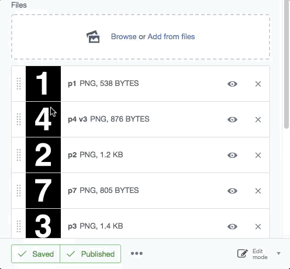

Sortable UploadField
============

[](https://scrutinizer-ci.com/g/bummzack/sortablefile/?branch=master)
[](https://codecov.io/gh/bummzack/sortablefile)
[](https://travis-ci.org/bummzack/sortablefile)
[](https://packagist.org/packages/bummzack/sortablefile)
[](https://packagist.org/packages/bummzack/sortablefile)
[](https://packagist.org/packages/bummzack/sortablefile)


An extension for SilverStripe 4.1+ that allows sorting of files attached via `UploadField`.

This module decorates the existing `UploadField` and adds sorting capabilities to it.
This is meant to be used with a `many_many` relation of Files or Images.



Installation
------------

This module only works with SilverStripe 4.1+.

For a version compatible with SilverStripe 3, please use a `1.x` release.

The easiest way is to use [composer](https://getcomposer.org/):

    composer require bummzack/sortablefile ^2.0

Run `dev/build` afterwards.

Usage
-------------

Usage is pretty simple. Just use `SortableUploadField` instead of `UploadField` to manage your `many_many` relations.
To persist the sort-order, an additional extra-field with the sort-order has to be added to the `many_many` relation.
You can do so by specifying the sort column via `many_many_extraFields` (see example below).

By default the `SortableUploadField` assumes that the sort-column is named `SortOrder`. If you want to use another
field-name (for example `Sort`), you have to explicitly set it:

    SortableUploadField::create('Files')->setSortColumn('Sort');

Example setup for many_many
-------------

Let's assume we have a `PortfolioPage` that has multiple `Images` attached.

The `PortfolioPage` looks like this:

```php
use SilverStripe\Assets\Image;
use SilverStripe\Forms\FieldList;
use Bummzack\SortableFile\Forms\SortableUploadField;

class PortfolioPage extends Page
{
    // This page can have many images
    private static $many_many = [
        'Images' => Image::class
    ];

    // this adds the SortOrder field to the relation table.
    // Please note that the key (in this case 'Images')
    // has to be the same key as in the $many_many definition!
    private static $many_many_extraFields = [
        'Images' => ['SortOrder' => 'Int']
    ];

    public function getCMSFields()
    {
        $this->beforeUpdateCMSFields(function (FieldList $fields) {
            $fields->addFieldToTab('Root.Main', SortableUploadField::create(
                'Images', $this->fieldLabel('Images')
            ));
        });

        return parent::getCMSFields();
    }
}
```

Once this has been set up like described above, then you should be able to add images in the CMS
and sort them by dragging them (use the handle on the left).

Templates
-------------

Sorting the Files via a relation table isn't easily achievable via a DataExtension. This is why it's currently up to the user to implement a getter that will return the sorted files, something along the lines of:

```php
// Use this in your templates to get the correctly sorted images
public function SortedImages()
{
    return $this->Images()->Sort('SortOrder');
}
```

And then in your templates use:

```html+smarty
<% loop $SortedImages %>
  $ScaleWidth(500)
<% end_loop %>
```

Alternatively, you could simply use the sort statement in your template, which will remove the need for a special getter method in your page class.

```html+smarty
<% loop $Images.Sort('SortOrder') %>
  $ScaleWidth(500)
<% end_loop %>
```

Many Many Through
-------------

The module supports editing many many through lists as well. The advantage of using `many_many through` is, that your relations can be versioned properly.

### Example Setup

Here's an example setup with the same `PortfolioPage` as above, but now using `many_many through` instead. If this seems unclear, please also consult the [official documentation](https://docs.silverstripe.org/en/4/developer_guides/model/relations/#many-many-through-relationship-joined-on-a-separate-dataobject).

First, the `PortfolioPage` class:

```php
<?php

use Bummzack\SortableFile\Forms\SortableUploadField;
use SilverStripe\Forms\FieldList;

class PortfolioPage extends Page
{
    private static $many_many = [
        'Images' => [
            'through' => PortfolioImage::class,
            'from' => 'PortfolioPage',
            'to' => 'Image',
        ]
    ];

    // This is required to automatically publish your images
    // whenever you publish your page
    private static $owns = [
        'Images'
    ];

    // This is required to publish deletions as well,
    // as this will not happen by default!
    private static $cascade_deletes = [
        'Images'
    ];

    public function getCMSFields()
    {
        $this->beforeUpdateCMSFields(function (FieldList $fields) {
            $fields->addFieldToTab('Root.Main', SortableUploadField::create(
                'Images', $this->fieldLabel('Images')
            ));
        });

        return parent::getCMSFields();
    }

    // This is a helper method, that is needed to display the items in the
    // correct order. Is required for proper CMS functionality and can be
    // used in templates as $getImages
    public function getImages()
    {
        return $this->Images()->sort('SortOrder');
    }
}
```

The idea of the `many_many through` relation is, that you have an intermediate DataObject, that connects your objects. So we add a DataObject named `PortfolioImage`:

```php
<?php

use SilverStripe\Assets\Image;
use SilverStripe\ORM\DataObject;
use SilverStripe\Versioned\Versioned;

class PortfolioImage extends DataObject
{
    private static $db = [
        'SortOrder' => 'Int'
    ];

    private static $has_one = [
        'Image' => Image::class,
        'PortfolioPage' => PortfolioPage::class
    ];

    private static $default_sort = 'SortOrder';

    // It's important that you add the Versioned extension to this!
    private static $extensions = [
        Versioned::class
    ];
}
```

We should also add the `belongs_many_many` relation to the `Image` class. This is very easy to do via config. So in your `mysite/_config/config.yml` add:

```yml
SilverStripe\Assets\Image:
  belongs_many_many:
    PortfolioPages: PortfolioPage.Images
```


What happened to `has_many` support?
-------------

Support for `has_many` relations has been dropped, since it can lead to a very bad user experience if a file can only be added to a single page.
Imagine a user added an image to `Page A`, then adds the same image via _Add from files_ to `Page B`.
The file would then be removed from `Page A`, without any warning or explanation, which is bad UX.
